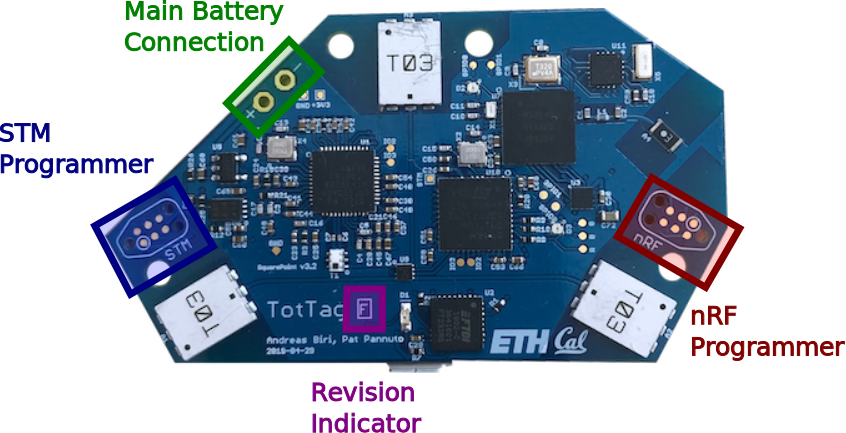
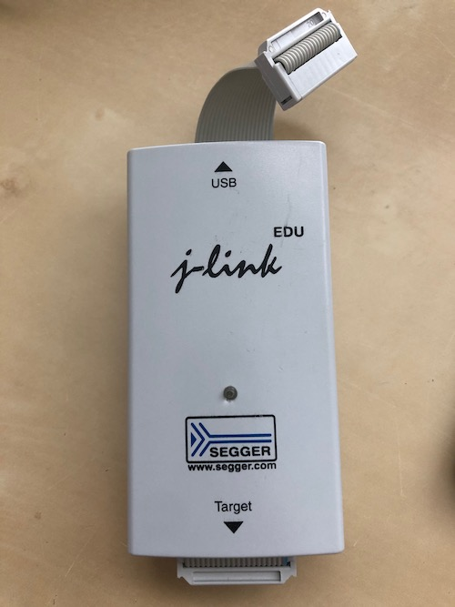
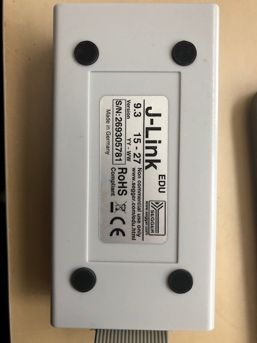
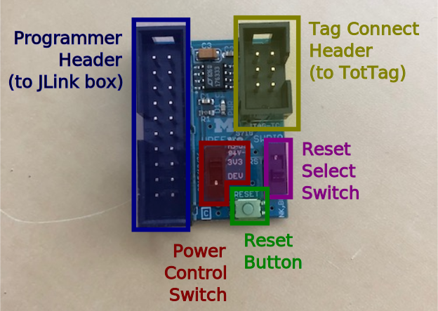
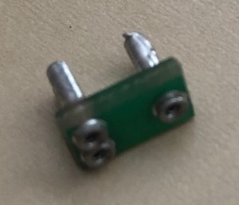
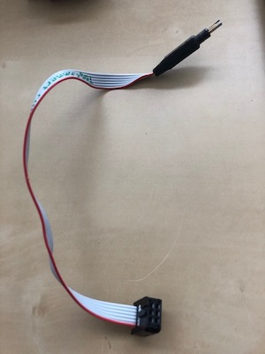

Getting Started
===============

This document covers the basic pieces and has all the directions for software you will need.

<!-- npm i -g markdown-toc; markdown-toc -i GettingStarted.md -->

<!-- toc -->

- [Hardware Glossary](#hardware-glossary)
- [Software Glossary](#software-glossary)
- [Miscellaneous](#miscellaneous)

<!-- tocstop -->

## Hardware Glossary

These are all the major pieces of the platform and supporting development environment.
You should make sure you have all of these pieces before getting going.

<table>
  <tr><th>Name</th><th>Picture</th><th>What it is used for</th></tr>
  <tr>
    <td>TotTag</td>
    <td>
      
      
    </td>
    <td>
      
This is the TotTag hardware.

      
Most of the time you should not need to worry about what parts of the
      board do what things, however it is important to pay attention to the two
      programming headers.

      
In general, you should also try to avoid having any large amounts of
      metal near any of the antennas.

      
<strong>Note:</strong> The Device ID is just a sticker on the board.
      When the board is programmed, you manually set the ID to match this sticker.

    </td>
  </tr>
  <tr>
    <td>
      
<a href="https://www.segger.com/products/debug-probes/j-link/models/j-link-edu/">JLink Programmer</a>

      
<small>Note: Link is to the EDU edition, which should be much cheaper ($60 vs $378 at time of writing)</small>

    </td>
    <td>
      
      
    </td>
    <td>
      
This is the JLink programmer. Often just the word "programmer" or "JLink" will be used, they all mean this box.

      
Working with TotTags you may frequently have multiple JLinks plugged
      into your machine. On the back of each box is a serail number (the S/N
      part) that you can use to choose a specific programmer.

    </td>
  </tr>
  <tr>
    <td>
      
JLink Adapter

    </td>
    <td>
      
    </td>
    <td>
      
This is an adapter board designed by the Lab11 team.

      
You can get <a href="http://www.tag-connect.com/adaptors">similar boards</a>
      from Tag Connect directly, but they do not have the power control or reset button.

      
<strong>Note:</strong> For TotTag the switch should <strong>always</strong>
      be in the unlabeled or down position (the top position says <tt>RST</tt>).
      
<strong>Note:</strong> Pay attention to the power switch. If the tag is plugged into
      USB or attached to a battery, the switch should be in the <tt>DEV</tt> ("power from device")
      position. If the tag is only plugged into the programmer, it should be in the <tt>3V3</tt>
      ("3.3V from the programmer box") position.

    </td>
  </tr>
  <tr>
    <td>TagConnect Cable</td>
    <td>
      <table>
        <tr>
          <td></td>
          <td rowspan="2"></td>
        </tr>
        <tr>
          <td></td>
        </tr>
      </table>
    </td>
    <td>
      
The <a href="http://www.tag-connect.com/TC2030-IDC-NL">TagConnect
      Cable</a> attaches the programmer to the board.

      
For quick use, just holding the spring-loaded pins in by hand works
      well. For extended use, there is a backing board that will fix the cable
      to the board.

    </td>
  </tr>
</table>

## Software Glossary

You will need to have each of these tools installed:

 - [git](https://git-scm.com/) - Version control software. Used to keep track
   of all of TotTag code and documentation.

 - [JLink Software](https://www.segger.com/downloads/jlink/#J-LinkSoftwareAndDocumentationPack) - Software
   for your computer to talk to the JLink programmer. You need to hit the
   "Click for Downloads" link under "J-Link Software and Documentation Pack".

## Miscellaneous

 - [The TotTernary Repository](https://github.com/lab11/totternary) - This
   website, where you will find all of the code and documentation for the
   platform.
