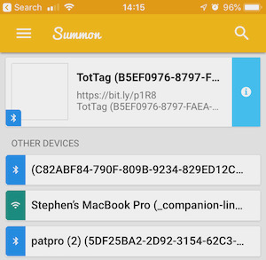

Provisioning
============

Every TotTag has two microcontrollers that must be programmed. In addition, the
ultra wideband radio has to be calibrated to realize high-accuracy ranging.

Uncalibrated devices should have the same quality of precision, but will have
a systemic absolute range offset of around half a meter.

<!-- npm i -g markdown-toc; markdown-toc -i Provisioning.md -->

<!-- toc -->

- [Hardware Glossary](#hardware-glossary)
- [Software Glossary](#software-glossary)
- [Miscellaneous](#miscellaneous)

<!-- tocstop -->

## Programming the nRF

This guide covers just the step-by-step requirements to program the nRF.
If you are doing development work, there is more information on the [Carrier
README](../software/carrier).

1. Connect the JLink programmer to the nRF programming header (right side of the board).

   

   Do not worry about the LEDs at this stage, they will be something random as
   the boards are not yet programmed.

1. Go to the [carrier node application folder](../software/carrier/apps/node):

        cd lab11/totternary/software/carrier/apps/node

1. Ensure all submodules are up to date:

        git submodule update --init --recursive

1. Clean up any old build artifacts:

        make clean

1. You will need the JLink serial number (`S/N` on the back of the JLink) and
   the TotTag Device ID (sticker on the back of the tag):

        make flash SEGGER_SERIAL=269305781 BLE_ADDRESS=c0:98:e5:42:f0:00

   It is important to watch the end of the output. A lot of text will fly by,
   but near the end you should see:

        Downloading file [_build/node_sdk15_s140.hex]...
        Comparing flash   [100%] Done.
        Erasing flash     [100%] Done.
        Programming flash [100%] Done.
        Verifying flash   [100%] Done.

   Or possibly just:

        Downloading file [_build/node_sdk15_s140.hex]...
        Comparing flash   [100%] Done.

   The second case will happen if the device was already programmed correctly.

   Having problems? [Check the JLink FAQs.](./Glossary.md#debugging-jlink-problems)

## Programming the STM

Note these steps are very similar to programming the nRF. Key differences have been highlighted.

1. Connect the JLink programmer to the **STM programming header (left side of the board)**.

   

   Do not worry about the LEDs at this stage, they will be something random as
   the boards are not yet programmed.

1. Go to the [module firmware folder](../software/module/firmware):

        cd lab11/totternary/software/module/firmware

1. Ensure all submodules are up to date:

        git submodule update --init --recursive

1. Clean up any old build artifacts:

        make clean

1. You will need the JLink serial number (`S/N` on the back of the JLink) and
   the TotTag Device ID (sticker on the back of the tag):

        # Note this is ID= now, instead of BLE_ADDRESS=
        make flash SEGGER_SERIAL=269305781 ID=c0:98:e5:42:f0:00

   It is important to watch the end of the output. A lot of text will fly by,
   but near the end you should see:

        Downloading file [_build/firmware.bin]...
        Comparing flash   [100%] Done.
        Erasing flash     [100%] Done.
        Programming flash [100%] Done.
        Verifying flash   [100%] Done.

   Or possibly just:

        Downloading file [_build/firmware.bin]...
        Comparing flash   [100%] Done.

   The second case will happen if the device was already programmed correctly.

   Having problems? [Check the JLink FAQs.](./Glossary.md#debugging-jlink-problems)

## Pause to test basic operation

At this point, basic operation of the board should work. You will need to power
cycle the board so that both microcontrollers will reset. Assuming no other
tags are nearby, both LEDs should be on solid blue:

Open the [Summon App](Glossary#software-glossary) and verify that you can see
the new TotTag:

