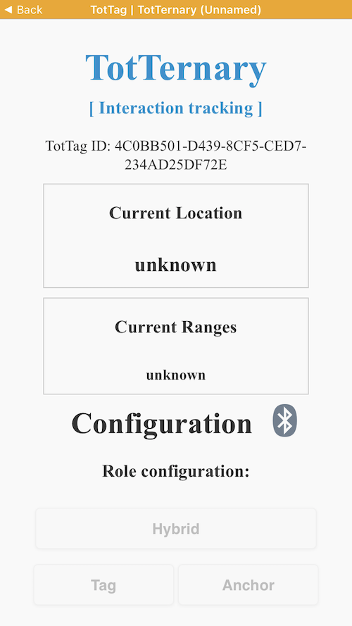
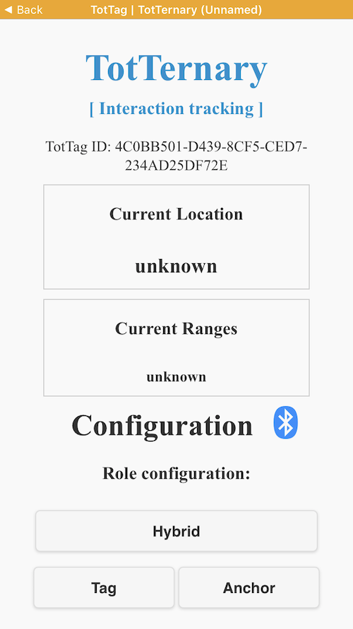
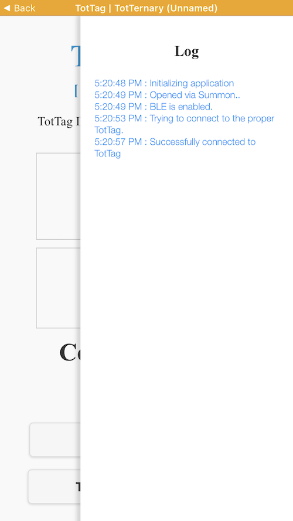
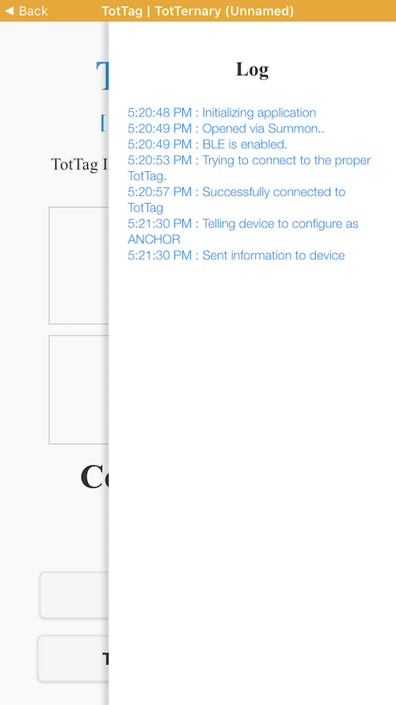

Provisioning
============

Every TotTag has two microcontrollers that must be programmed. In addition, the
ultra wideband radio has to be calibrated to realize high-accuracy ranging.

Uncalibrated devices should have the same quality of precision, but will have
a systemic absolute range offset of around half a meter.

<!-- npm i -g markdown-toc; markdown-toc -i Provisioning.md -->

<!-- toc -->

- [Programming the nRF](#programming-the-nrf)
- [Programming the STM](#programming-the-stm)
- [Pause to test basic operation](#pause-to-test-basic-operation)
- [Calibration](#calibration)
- [Re-programming](#re-programming)
- [Debugging](#debugging)

<!-- tocstop -->

## Programming the nRF

This guide covers just the step-by-step requirements to program the nRF.
If you are doing development work, there is more information on the [Carrier
README](../software/carrier).

1. Connect the JLink programmer to the nRF programming header (right side of the board).

   

   Do not worry about the LEDs at this stage, they will be something random as
   the boards are not yet programmed.

1. Go to the [carrier node application folder](../software/carrier/apps/node):

        cd lab11/totternary/software/carrier/apps/node

1. Ensure repository is up to date with latest software:

    ```bash
    git pull

    git status
    # On branch master
    # Your branch is up to date with 'origin/master'.
    ```

1. Ensure all submodules are up to date:

        git submodule update --init --recursive

1. Clean up any old build artifacts:

        make clean

1. You will need the JLink serial number (`S/N` on the back of the JLink) and
   the TotTag Device ID (sticker on the back of the tag):

        make flash SEGGER_SERIAL=269305781 BLE_ADDRESS=c0:98:e5:42:00:01

   It is important to watch the end of the output. A lot of text will fly by,
   but near the end you should see:

        Downloading file [_build/node_sdk15_s140.hex]...
        Comparing flash   [100%] Done.
        Erasing flash     [100%] Done.
        Programming flash [100%] Done.
        Verifying flash   [100%] Done.

   Or possibly just:

        Downloading file [_build/node_sdk15_s140.hex]...
        Comparing flash   [100%] Done.

   The second case will happen if the device was already programmed correctly.

   Having problems? [Check the JLink FAQs.](./Glossary.md#debugging-jlink-problems)


## Programming the STM

Note these steps are very similar to programming the nRF. Key differences have been highlighted.

1. Connect the JLink programmer to the **STM programming header (left side of the board)**.

   

   Do not worry about the LEDs at this stage, they will be something random as
   the boards are not yet programmed.

1. Go to the [module firmware folder](../software/module/firmware):

        cd lab11/totternary/software/module/firmware

1. Ensure repository is up to date with latest software:

    ```bash
    git pull

    git status
    # On branch master
    # Your branch is up to date with 'origin/master'.
    ```

1. Ensure all submodules are up to date:

        git submodule update --init --recursive

1. Clean up any old build artifacts:

        make clean

1. You will need the JLink serial number (`S/N` on the back of the JLink) and
   the TotTag Device ID (sticker on the back of the tag):

        # Note this is ID= now, instead of BLE_ADDRESS=
        make flash SEGGER_SERIAL=269305781 ID=c0:98:e5:42:00:01

   It is important to watch the end of the output. A lot of text will fly by,
   but near the end you should see:

        Downloading file [_build/firmware.bin]...
        Comparing flash   [100%] Done.
        Erasing flash     [100%] Done.
        Programming flash [100%] Done.
        Verifying flash   [100%] Done.

   Or possibly just:

        Downloading file [_build/firmware.bin]...
        Comparing flash   [100%] Done.

   The second case will happen if the device was already programmed correctly.

   Having problems? [Check the JLink FAQs.](./Glossary.md#debugging-jlink-problems)


## Pause to test basic operation

At this point, basic operation of the board should work. You will need to power
cycle the board so that both microcontrollers will reset. Assuming no other
tags are nearby, both LEDs should be on solid blue:


Open the [Summon App](Glossary#software-glossary) and verify that you can see
the new TotTag:


If you click on the TotTag entry, it should open the TotTag application.
Notice that when the app first opens, all of the buttons are greyed out still,
it will take a few seconds for the tag to connect to the phone:



Once the tag has connected, the buttons will become clickable:



Notice in these screen captures, the TotTag ID looks like a long random string.
This is because this guide used an iPhone to grab the screen shots, and iOS
does not allow apps to see device addresses. If you use an Android device, you
will see the actual TotTag address here.

There is no visual indicator for this, but if you slide from the right side of
the screen, you can pull up a debug pane, that should help see what the Summon
app and TotTag are doing:



For example, if you click the `Anchor` button to instruct this tag to act as an
achor, you can verify it succeeded using the debug bar:




## Calibration

**STOP. Before beginning calibration, it is recommended to finish initial setup
of all nodes. This will save on re-programming time later.**

[Please follow the directions in the calibration documentation](../software/calibration/README.md#Detailed-Instructions)


## Re-programming

**STOP. Don't do the final reprogram for nodes until you have finished
calibrating all nodes. It's usually faster this way.**

Follow the initial programming steps again. You will need to reprogram the nRF
to take it out of calibration mode and reprogram the STM to include new
calibration data.


# Debugging

To verify that the nodes are working, you can connect two JLink programmers to the board, one for each programming header (see above).
Then open up four terminal windows and enter the following to connect to the STM using the *first* JLink (replace `XXXXXXXXX` with the serial number of the JLink connected to the left header):

    Terminal 1: $    JLinkExe -Device STM32F091CC -if SWD -speed 4000 -RTTTelnetPort 9200 -SelectEmuBySN XXXXXXXXX
    
    Terminal 2: $    telnet localhost 9200
    
Do the same thing now for the nRF, whereby you enter the serial number of the *second* JLink programmer for `XXXXXXXXX`:
    
    Terminal 3: $    JLinkExe -Device NRF52840_XXAA -if SWD -speed 4000 -RTTTelnetPort 9201-SelectEmuBySN XXXXXXXXX
    
    Terminal 4: $    telnet localhost 9201 
    
In a second step, you can now connect to the controllers and start producing output:

    Terminal 1: $    J-Link>connect
                     J-Link>r
                     
    Terminal 3: $    J-Link>connect
                     J-Link>r          

Now that you have successfully connected to both of the chips and reset them (using the second `r` command), it is time to execute the programs. To do so, **first start the STM and thereafter the nRF**; if you change the order, you will observe errors (white LED flashing) as the nRF tries to communicate with the STM during startup.
To start the chips, simply enter:

    Terminal 1: $    J-Link>g
    
    <-- AFTER starting the STM in Terminal 1, you can then execute the command below in Terminal 3 to start the nRF -->
    
    Terminal 3: $    J-Link>g
    
Now, you should observe the startup debug output in the corresponding terminals 2 and 4:

    Terminal 2: $    ----------------------------------------------
                     INFO: Initialized RTT...
                     INFO: Successfully loaded calibration values with EUI XX
                     INFO: Connecting to host interface...
                     [...]
    
    Terminal 4: $    ----------------------------------------------
                     INFO: Initializing nRF...
                     INFO: Initialized software modules
                     [...]

In case you would like to restart the chips, simply enter `r` followed by `g` in the corresponding terminals 1 and 3. Make sure to **always first restart the STM before restarting the nRF**.

To exit debugging, enter `qc` in terminals 1 and 3:

    Terminal 1: $    J-Link>qc
    
    Terminal 3: $    J-Link>qc