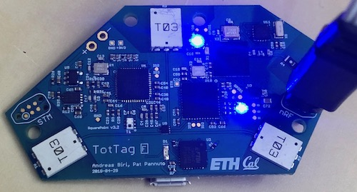
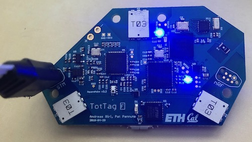

Provisioning
============

Every TotTag has two microcontrollers that must be programmed. In addition, each
new revision of the board hardware needs to be calibrated to ensure high-accuracy
ranging using the Ultra Wideband Radio.

If you are using an existing TotTag or have printed your own circuit board using
the designs and schematics in this repository, you should not need to perform any
further calibrations. If you are using the TotTag infrastructure in your own
design, however, you will need to carry out the calibration procedure or you may
experience a systemic absolute range offset on the order of half a meter or more.

This document will explain how to program the board microcontrollers, perform
calibration, and carry out device debugging:

- [Programming the nRF Microcontroller](#programming-the-nrf-microcontroller)
- [Programming the STM Microcontroller](#programming-the-stm-microcontroller)
- [Testing Basic Operation](#test-basic-operation)
- [Calibration](#calibration)
- [Debugging](#debugging)

## Checkout the firmware before revision H
This guide is for TotTag hardware up to revision H. You need to checkout the older firmware as the latest firmware is no longer designed for STM32 + nRF TotTag.

```bash
git checkout 67cdde4991d016ee61d7ed7892941ad19e543c95
```

To ensure that the submodules are downloaded, you might need to run

```bash
git submodule update --init --recursive
```

## Programming the nRF Microcontroller

This guide covers the step-by-step requirements necessary to program the nRF
microcontroller. If you are doing development work, there is more information in
the [TotTag README](../software/tottag/firmware).

1. Connect the JLink programmer to the nRF programming header:

   

   Do not worry about the LEDs at this stage, they will be random as the boards
   are not yet programmed.

2. Navigate to the [SociTrack root folder](..):

        cd socitrack

3. Ensure the repository is up to date with latest software:

        git pull --recurse-submodules
        git status
        # On branch master
        # Your branch is up to date with 'origin/master'.

4. Go to the [TotTag folder](../software/tottag):

        cd socitrack/software/tottag

5. Clean up any old build artifacts:

        make clean

6. Build the TotTag firmware. You will need the JLink serial number (`S/N` on
   the back of the JLink) and optionally, the TotTag Device ID
   (sticker on the back of the TotTag):

        make SEGGER_SERIAL=<segger_id> flash

   or to specify the Device ID (should only be done the first time the TotTag
   is being programmed):

        make SEGGER_SERIAL=<segger_id> ID=c0:98:e5:42:00:01 flash

   It is important to watch the end of the output. A lot of text will fly by,
   but near the end you should see:

        Downloading file [_build/node_sdk15_s140.hex]...
        Comparing flash   [100%] Done.
        Erasing flash     [100%] Done.
        Programming flash [100%] Done.
        Verifying flash   [100%] Done.

   Or possibly just:

        Downloading file [_build/node_sdk15_s140.hex]...
        Comparing flash   [100%] Done.

   The second case will happen if the device was already programmed correctly.

   If you are flashing the firmware for use in a debugging or development
   environment, append the flag `DEBUG_MODE=1` to the make command to enable
   certain debugging tasks and device checks:

        make SEGGER_SERIAL=<segger_id> DEBUG_MODE=1 flash

   Having problems? Check the [JLink FAQs.](./Glossary.md#miscellaneous)


## Programming the STM Microcontroller

These steps are very similar to programming the nRF microcontroller. Key
differences have been highlighted.

1. Connect the JLink programmer to the **STM programming header**.

   

   Do not worry about the LEDs at this stage, they will be random as the boards
   are not yet programmed.

2. Navigate to the [SociTrack root folder](..):

        cd socitrack

3. Ensure the repository is up to date with latest software:

        git pull --recurse-submodules
        git status
        # On branch master
        # Your branch is up to date with 'origin/master'.

4. Go to the [SquarePointer folder](../software/squarepoint):

        cd socitrack/software/squarepoint

5. Clean up any old build artifacts:

        make clean

6. Build the SquarePoint firmware. You will need the JLink serial number (`S/N`
   on the back of the JLink):

        make SEGGER_SERIAL=<segger_id> flash

   It is important to watch the end of the output. A lot of text will fly by,
   but near the end you should see:

        Downloading file [_build/squarepoint.bin]...
        Comparing flash   [100%] Done.
        Erasing flash     [100%] Done.
        Programming flash [100%] Done.
        Verifying flash   [100%] Done.

   Or possibly just:

        Downloading file [_build/squarepoint.bin]...
        Comparing flash   [100%] Done.

   The second case will happen if the device was already programmed correctly.

   Having problems? Check the [JLink FAQs.](./Glossary.md#miscellaneous)


## Test basic operation

At this point, basic operation of the board should work. You will need to power
cycle the board so that both microcontrollers reset. Assuming no other tags are
nearby, both LEDs should turn solid blue:


## Calibration

**STOP. Do not perform calibration unless you have just created a new hardware
board revision. Before beginning calibration, you will need to finish the initial
setup of 3 different nodes. There is no point in setting up more than 3 nodes,
as they will all have to be reprogrammed again after calibration has completed.**

Please follow the directions in the [Calibration Documentation](../software/tottag/calibration/README.md)

Once you have finished the calibration procedure, you will need to reprogram the
nRF microcontroller for all 3 nodes you just used during calibration to ensure
they are not stuck in calibration mode. You will also need to reprogram the STM
microcontrollers on these same nodes to ensure they make use of the new
calibration data.


# Debugging

To verify that the nodes are working, you can connect two JLink programmers to
the board, one for each programming header (see above). Then, open up four
terminal windows, and enter the following commands *in order*. First, you will
connect to the STM microcontroller by entering the following (replace
`XXXXXXXXX` with the serial number of the JLink connected to the STM header,
and replace the `JLinkExe` command with `JLink` on Windows):

    Terminal 1: $    JLinkExe -Device STM32F091CC -if SWD -speed 4000 -RTTTelnetPort 9200 -SelectEmuBySN XXXXXXXXX

    Terminal 2: $    telnet localhost 9200

Do the same thing now for the nRF, whereby you enter the serial number of the
*second* JLink programmer for `XXXXXXXXX`:

    Terminal 3: $    JLinkExe -Device NRF52840_XXAA -if SWD -speed 4000 -RTTTelnetPort 9201 -SelectEmuBySN XXXXXXXXX

    Terminal 4: $    telnet localhost 9201

You can now connect to the microcontrollers and start producing output:

    Terminal 1: $    J-Link>connect
                     J-Link>r

    Terminal 3: $    J-Link>connect
                     J-Link>r

Now that you have successfully connected to both of the chips and reset them
(using the second `r` command), it is time to execute the programs. To do so,
**first start the STM and thereafter the nRF**:

    Terminal 1: $    J-Link>g

    <-- AFTER starting the STM in Terminal 1, you can then execute the command below in Terminal 3 to start the nRF -->

    Terminal 3: $    J-Link>g

Now, you should observe the startup debug output in the corresponding terminals
2 and 4:

    Terminal 2: $    ----------------------------------------------
                     INFO: Initialized RTT...
                     INFO: Successfully loaded calibration values with EUI XX
                     INFO: Connecting to host interface...
                     [...]

    Terminal 4: $    ----------------------------------------------
                     INFO: Initializing nRF...
                     INFO: Initialized software modules
                     [...]

In case you would like to restart the chips, simply enter `r` followed by `g`
in the corresponding terminals 1 and 3. Make sure to **always first restart the STM before restarting the nRF**.

To exit debugging, enter `qc` in terminals 1 and 3:

    Terminal 1: $    J-Link>qc

    Terminal 3: $    J-Link>qc
