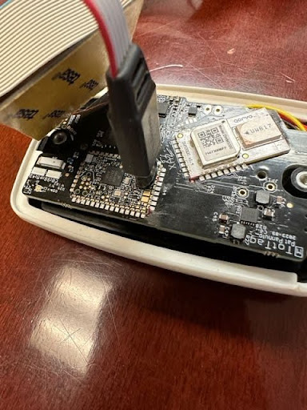

# Getting Started

This page takes a badge from "box of hardware" to "ready for a study". You need to do it once per
badge. If your badges are already set up, skip to [Running a Deployment](running-a-deployment.md).

---

## What you need

### Hardware

A **SEGGER J-Link programmer** and two cables to reach the badge's programming pads:

- [J-Link EDU Probe](https://shop-us.segger.com/product-category/debug-probes/educational/) — heavily
  discounted for educational and research use. The commercial
  [J-Link](https://www.segger.com/products/flasher-in-circuit-programmer/) works identically.
- [Tag-Connect TC2050-ARM2010 adapter](https://www.tag-connect.com/product/tc2050-arm2010-arm-20-pin-to-tc2050-adapter) (20-pin to 10-pin)
- [Tag-Connect TC2050-IDC-NL cable](https://www.tag-connect.com/product/tc2050-idc-nl-10-pin-no-legs-cable-with-ribbon-connector) (10-pin, no legs)

The programmer is only needed for setup. Once a badge is running you never need it again unless you
update firmware.

### Software

- [SEGGER J-Link Software Pack](https://www.segger.com/downloads/jlink/)
- The ARM embedded toolchain — `brew install --cask gcc-arm-embedded` on macOS,
  `sudo apt install gcc-arm-none-eabi` on Debian or Ubuntu, or a
  [direct download](https://developer.arm.com/downloads/-/arm-gnu-toolchain-downloads). Any recent
  version works; the firmware is built and tested with GCC 15.
- The source: `git clone https://github.com/lab11/socitrack`

Check the toolchain is on your path before going further:

```bash
arm-none-eabi-gcc --version
```

---

## Find your board revision

**Do this before flashing.** The revision is silkscreened on the board — a single letter, one of
**M**, **N**, **O** or **P**.

Each revision has a different pinout. Firmware built for the wrong one compiles perfectly and then
drives the wrong pins, which looks like a dead or erratic badge rather than an obvious error. It is
worth checking rather than assuming, especially with a mixed set of badges.

Every command below uses `BOARD_REV=P`. Substitute your own letter. `P` is the default if you omit it.

---

## Step 1 — Connect the programmer

1. Plug the Tag-Connect adapter and cable into the J-Link.
2. Plug the J-Link into your computer over USB.
3. Press the Tag-Connect cable into the pads on the badge labelled **XA2**.

The no-legs cable is held in place by hand or with a clip — it does not latch. Keep gentle pressure on
it for the whole of each command below.



---

## Step 2 — Give the badge an ID (once per badge, ever)

Every badge needs a unique identifier, in the form `c0:98:e5:42:00:XX`. Only the last byte `XX` is
yours to choose — any two hex digits, so `00` through `FF`.

```bash
cd socitrack/software/firmware
make ID=c0:98:e5:42:00:02 UID
```

**Choose carefully and write it down.** That last byte is how the badge identifies itself everywhere
— in the dashboard device list, in the log files, and in your analysis. Giving two badges the same ID
will make a deployment impossible to interpret. A piece of tape on the case with the last two digits
saves a great deal of confusion later.

This step is permanent and only needs doing once. Re-flashing firmware does not erase it.

---

## Step 3 — Load the firmware

```bash
make BOARD_REV=P flash
```

Watch the end of the output. You are looking for:

```
Downloading file [bin/SociTrack.bin]...
Comparing flash   [100%] Done.
Erasing flash     [100%] Done.
Programming flash [100%] Done.
Verifying flash   [100%] Done.
```

Seeing only `Comparing flash [100%] Done.` is also success — it means the badge already had exactly
this firmware and nothing needed rewriting.

If you have several J-Links plugged in, name the one you want:

```bash
make BOARD_REV=P SEGGER_SERIAL=123456789 flash
```

---

## Step 4 — Confirm it works

Unplug everything, close the case, replace the screws, and set the badge on a wireless charger.

**You should hear a short rising chime.** That is the badge telling you it has booted, detected the
charger, and is healthy. No chime means something is wrong — start with
[Troubleshooting](troubleshooting.md#a-badge-makes-no-sound-on-the-charger).

Repeat for each badge.

---

## Updating firmware later

```bash
cd socitrack
git pull
cd software/firmware
make clean
make BOARD_REV=P flash
```

`make clean` matters when switching revisions, because object files from a previous build are not
revision-aware.

Updating firmware **does not** erase the badge's ID or its stored logs. Download anything you still
need first, though — a firmware change can alter the log format, and the tools assume a log was
written by firmware of the same era.

### Updating the Bluetooth controller

The Bluetooth radio runs its own separate firmware, and it is almost never the thing that needs
updating. If you have been told to update it:

```bash
make BOARD_REV=P flashb
```

This writes the controller image first, waits for it to apply, then writes the application. See
[the controller firmware notes](internals/ble-controller-firmware.md) for the detail.

---

## Next

Your badges are ready. [Running a Deployment](running-a-deployment.md) covers scheduling a study and
collecting the data.
