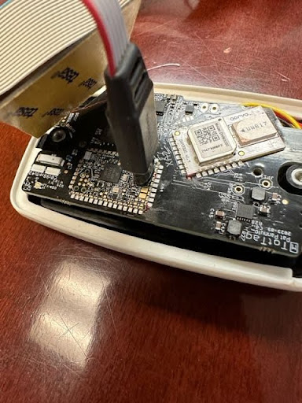

TotTag Firmware
===============

This firmware is intended for use with the Ambiq Apollo4 line of microcontrollers and contains all
ranging and localization algorithms for the TotTag system.

Getting Started
---------------

To install this firmware onto a TotTag device, you will need to obtain a
[J-Link Programmer from SEGGER](https://www.segger.com/products/flasher-in-circuit-programmer/). If you are using this
product for educational or research purposes, you may be able to obtain a programmer at a significantly reduced price, such
as the [J-Link EDU Probe](https://shop-us.segger.com/product-category/debug-probes/educational/). You will also need a
set of cables to connect the programmer to the TotTag board:

* [Tag-Connect 20-pin to 10-pin IDC adapter](https://www.tag-connect.com/product/tc2050-arm2010-arm-20-pin-to-tc2050-adapter)
* [Tag-Connect 10-Pin No-Legs Plug-of-Nails™ Cable](https://www.tag-connect.com/product/tc2050-idc-nl-10-pin-no-legs-cable-with-ribbon-connector)

You will also need to install the [SEGGER J-Link Software and Documentation Pack](https://www.segger.com/downloads/jlink/)
onto your computer.

Once these items have been taken care of, you can flash the firmware onto a device using the following procedure:

1. Connect the Tag-Connect adapter and cable to the J-Link Programmer.
2. Connect one end of the J-Link Programmer to your computer via USB.
3. Connect the other end of the J-Link Programmer to the TotTag device by inserting the Tag-Connect cable into the
set of holes on the TotTag board labeled "XA2" (see image below).
4. On your computer, navigate to the root of this firmware directory (i.e., `cd socitrack/software/firmware`).
5. If this is the first time you are programming your TotTag, you will need to assign it a unique ID in the form of
`c0:98:e5:42:00:XX` where you are free to choose whichever values you would like for `XX`. Valid values for X are all
integers and all characters between 'A-F' (i.e., 2 valid IDs might be `c0:98:e5:42:00:02` or `c0:98:e5:42:00:F3`).
7. Assign your chosen ID to the TotTag by typing `make ID=c0:98:e5:42:00:XX UID` (**YOU ONLY NEED TO DO THIS ONCE**).
8. Flash the firmware onto the TotTag by entering `make flash`.
9. If everything was successful, you should hear a happy sounding chime when you place the TotTag on a wireless charger.
10. Remove all cables, close the TotTag case, and replace the screws.



Updating the Firmware
---------------------

If you ever need to update the firmware on your TotTag, you can always obtain the latest firmware
and flash it onto your device by doing the following (**REPLACE `BOARD_REV=X` WITH THE REVISION OF THE BOARD YOU ARE FLASHING**):

```
cd socitrack
git pull
cd software/firmware
make clean
make BOARD_REV=P flash
```

It is important to watch the end of the output whenever flashing the firmware to your device.
A lot of text will fly by, but near the end you should see:

```
Downloading file [bin/SociTrack.bin]...
Comparing flash   [100%] Done.
Erasing flash     [100%] Done.
Programming flash [100%] Done.
Verifying flash   [100%] Done.
```

Or possibly just:

```
Downloading file [bin/SociTrack.bin]...
Comparing flash   [100%] Done.
```

The second case will happen if the device was already programmed correctly.
